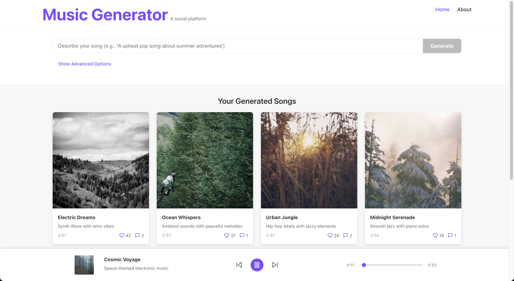

# Music Generator

A modern social platform for music discovery and sharing, featuring an interactive UI for playing, liking, and commenting on music.

🎵 **Live Demo**: [https://music-generator-q51rymip6-alexander-yf-yus-projects.vercel.app](https://music-generator-q51rymip6-alexander-yf-yus-projects.vercel.app)



## 🚀 Tech Stack

- **Frontend**:
  - React 19
  - TypeScript
  - Vite for build tooling
  - CSS3 for styling
  - Chakra UI for component library
  - Framer Motion for animations

- **Features**:
  - Responsive design
  - Music playback controls
  - Social interaction (likes, comments)
  - Modern UI with clean animations

## 🎯 User Stories

1. **Music Discovery**
   - Users can browse a collection of songs
   - Visual cards display song information and album art
   - Songs can be filtered and sorted (planned)

2. **Music Playback**
   - Play/pause songs directly from the song card
   - View play progress with a progress bar
   - Control volume and playback position
   - Continue browsing while music plays

3. **Social Interaction**
   - Like favorite songs
   - View comments from other users
   - Add personal comments to songs
   - See social stats (number of likes and comments)

4. **Song Details**
   - Click on a song to view detailed information
   - See full description and metadata
   - View all comments in a dedicated popup
   - Interact with content without interrupting playback

## 🛠️ Setup and Installation

### Prerequisites
- Node.js (v18 or newer)
- npm or yarn

### Installation

```bash
# Clone the repository
git clone https://github.com/your-username/music-generator.git

# Navigate to the project directory
cd music-generator

# Install dependencies
cd frontend
npm install
# or
yarn install

# Start the development server
npm run dev
# or
yarn dev
```

The app will be available at `http://localhost:5173`.

## 🚀 Deployment

### Deploying to Vercel

1. **Prepare your project**:
   ```bash
   # Make sure everything is committed to Git
   git add .
   git commit -m "Ready for deployment"
   ```

2. **Install Vercel CLI** (if not already installed):
   ```bash
   npm install -g vercel
   ```

3. **Deploy with Vercel**:
   ```bash
   # Navigate to the frontend directory
   cd frontend
   
   # Deploy with Vercel CLI
   vercel
   ```

4. **Follow the prompts**:
   - Log in with your GitHub account when prompted
   - Set up as a new project
   - Use default project settings for Vite

5. **Your project is now live**!

## 🔮 Future Enhancements

- User authentication
- Backend integration for persistent data
- Ability to create playlists
- Integration with AI for music generation
- Mobile app version

## 📝 License

MIT

## 👨‍💻 Contributing

Contributions, issues, and feature requests are welcome! Feel free to check the [issues page](https://github.com/your-username/music-generator/issues).

## 🙏 Acknowledgements

- [React documentation](https://react.dev)
- [Vite](https://vitejs.dev/)
- [Chakra UI](https://chakra-ui.com/)
- [Vercel](https://vercel.com/) for hosting
